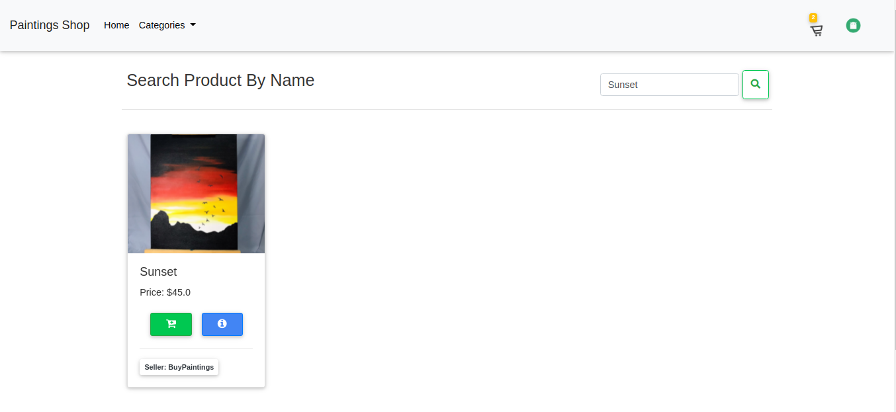

# E-commerce website using django 

[Live Demo](https://ecommerce-painting-shop.herokuapp.com/)

### Features

#### For Customers :
- Authentication System (Sign-up & Login)
- Product list and Views for User
- Search Functionality (customers can search any product by its name)
- Categorized product (customers can filter product by category)
- Add to cart
- Ordered products list view for customer
- Customer Profile (update)

#### For Seller Account:
- Authentication System (Sign-up/Login)
- Author Profile ( View and Edit Profile )
- Product List/Views/Update/Delete
- Seller Dashboard
- Search Functionality (Search Product/Category/Orders)
- Seller can Update and View Orders
- Seller can add their company name

## Home Page

## Add To Cart Page

## Search Page

## Seller Dashboard

